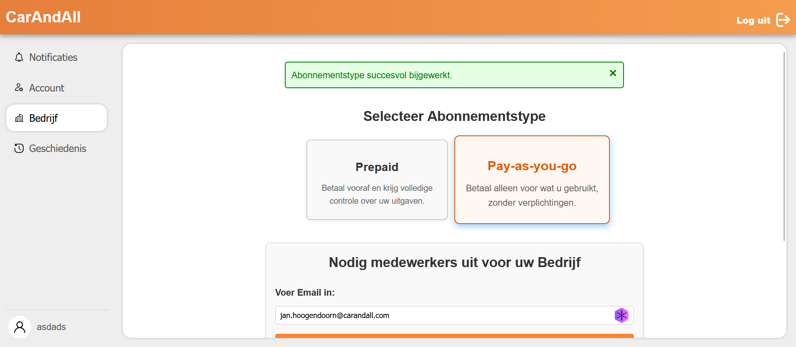
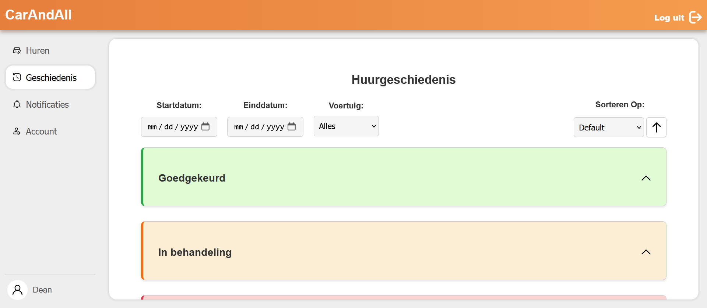

# CarAndAll - Vehicle Rental Management System

> 🎓 **Academic Group Project** | Full-Stack Web Application

> **Note:** The application interface and sample data are in Dutch, as required by our university project guidelines. All documentation and setup instructions are provided in English for international accessibility.

A full-stack vehicle rental management platform built with **ASP.NET Core** and **React** as part of our education. This project demonstrates modern web application development practices, including RESTful API design, authentication, database management, and responsive user interfaces.

The application enables users to browse available vehicles, submit rental requests, and manage their rental history. Business managers can approve/reject requests and manage their vehicle fleet.

## 📸 Screenshots

### Company Dashboard

*Overview of the company owner's dashboard*

### Vehicle Management

*Overview of rental history for customers*

## 🎯 Project Goals

This project was developed to demonstrate use in:
- Building RESTful APIs with ASP.NET Core
- Creating interactive single-page applications with React
- Implementing secure authentication and authorization
- Database design and ORM usage with Entity Framework Core
- Full-stack integration between frontend and backend
- Modern development workflows and tooling

## 🚀 Features

- **User Authentication & Authorization** - Registration and login system using ASP.NET Identity
- **Vehicle Management** - Browse and filter available vehicles with detailed information
- **Rental Request System** - Submit and track rental requests with approval workflow
- **Multi-Role Support** - Different user roles (customers, managers) with appropriate permissions
- **Notifications** - Status updates for rental requests
- **Company Management** - Business account features for fleet management
- **Damage Claims** - System for reporting and tracking vehicle damage
- **Responsive Design** - Mobile-friendly interface

## 🛠️ Tech Stack

### Backend
- **ASP.NET Core 8.0** - Web API framework
- **Entity Framework Core** - ORM with SQLite database
- **ASP.NET Identity** - Authentication and authorization
- **Swagger** - API documentation

### Frontend
- **React 18** - UI library
- **Vite** - Build tool and development server
- **React Router** - Client-side routing
- **Axios** - HTTP client

## 📝 API Documentation

When the backend is running, access the interactive API documentation:

- **Swagger UI**: `https://localhost:7159/swagger`

The Swagger interface allows you to:
- Browse all available endpoints
- Test API calls directly
- View request/response schemas

## 📁 Project Structure

```
CarAndAll-ASPReact/
├── CarAndAll-ASPReact.Server/          # ASP.NET Core Web API
│   ├── Controllers/                     # API Controllers
│   ├── Models/                          # Data models
│   ├── DTOs/                            # Data transfer objects
│   ├── Services/                        # Business logic services
│   ├── Migrations/                      # EF Core migrations
│   └── Program.cs                       # Application entry point
│
├── carandall-aspreact.client/          # React Frontend
│   ├── src/
│   │   ├── components/                  # Reusable components
│   │   ├── pages/                       # Page components
│   │   ├── api/                         # API client functions
│   │   ├── context/                     # React context providers
│   │   └── main.jsx                     # App entry point
│   ├── public/                          # Static assets
│   └── package.json                     # Node dependencies
│
└── CarAndAll-ASPReact.sln              # Visual Studio solution
```

## Running the Project Locally

If you'd like to explore the project locally:

**Prerequisites:** .NET 8.0 SDK, Node.js (v18+), Visual Studio 2022

**Quick Start:**
1. Clone the repository and open `CarAndAll-ASPReact.sln` in Visual Studio 2022
2. Run `dotnet dev-certs https --trust` (first time only)
3. Press **F5** to start - Visual Studio will launch both the backend and frontend automatically
4. The application opens at `https://localhost:58332`, API docs at `https://localhost:7159/swagger`

<details>
<summary><b>Alternative IDE's: Manual Command Line Setup</b></summary>

```bash
# Trust HTTPS certificate (first time only)
dotnet dev-certs https --trust

# Install frontend dependencies
cd carandall-aspreact.client
npm install

# Start backend (in one terminal)
cd CarAndAll-ASPReact.Server
dotnet run --launch-profile https

# Start frontend (in another terminal)
cd carandall-aspreact.client
npm run dev
```

Access: Frontend at `https://localhost:58332`, Backend API at `https://localhost:7159`
</details>

## 📄 License

This project is licensed under the terms specified in the [LICENSE.txt](LICENSE.txt) file.

## 💼 About

This project was created as part of our web development studies to demonstrate full-stack development capabilities. The project was built collaboratively by our team, with each member contributing to different aspects of the application. Feel free to explore the code and reach out if you have any questions!

---

**Built with ASP.NET Core 8.0 & React 18**